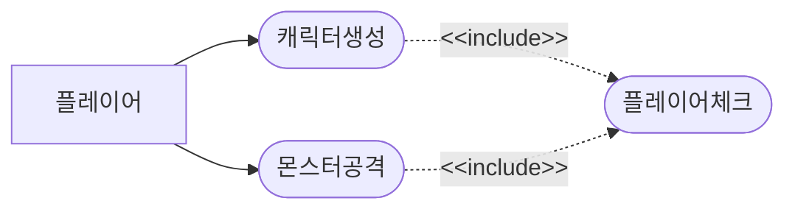

```mermaid
graph LR
    %% 액터(Actor)
    Player[플레이어]

    %% 유스케이스(Use Cases)
    UC1([캐릭터생성])
    UC2([몬스터공격])
    UC3([플레이어체크])

    %% 액터와 유스케이스 간의 관계
    Player --> UC1
    Player --> UC2

    %% 포함(Include) 관계 설정
    UC1 -. "&lt;&lt;include&gt;&gt;" .-> UC3
    UC2 -. "&lt;&lt;include&gt;&gt;" .-> UC3
```